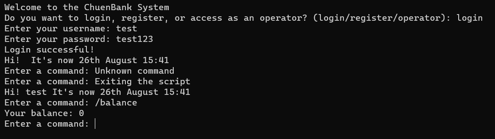

# ChuenBank V1 - Simple Banking App

Welcome to ChuenBank, a simple banking app for managing your finances!

## Installation

Good news! You don't need to install anything!

## Open the App

1. Download and extract the `chuenbank.zip` file.
2. Open it and click the `chuenbank.exe` file.
3. Have fun!

## Usage

- To login: Choose the `login` option and enter your username and password.
- To register: Choose the `register` option and follow the prompts.
- To deposit: Use the `/deposit` command and enter the amount to deposit.
- To withdraw: Use the `/withdraw` command and enter the amount to withdraw.
- To view transaction history: Use the `/transactions` command.

## Screenshots

### Login

### Check Balance

## Features

- Secure user registration and login
- Real-time balance checking
- Deposit and withdrawal functionality
- Transaction history tracking

## Troubleshooting

If you encounter any issues, contact us at memechuen@gmail.com.

## License

ChuenBank is open-source software released under the [MIT License](https://opensource.org/license/mit/).

## Acknowledgments

Thanks to the creators of [Pycharm](https://www.jetbrains.com/pycharm/) and [Chat GPT](https://chat.openai.com/) for helping me create this app.

## Contact

For any inquiries, please email us at memechuen@gmail.com.
&nbsp;
&nbsp;
&nbsp;
